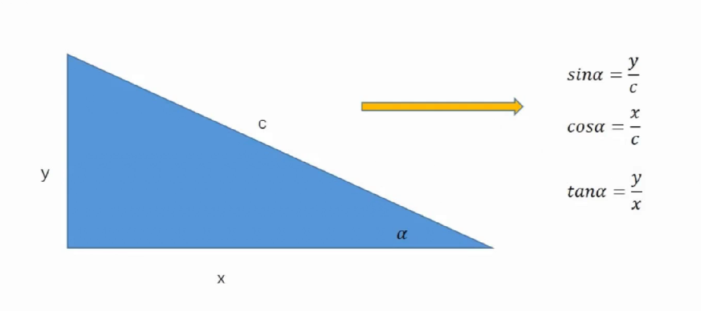

# 动画

## 基本概念

## 常用的三角函数



## 常用的反三角函数

```javascript
sin(α) = y/c ==> α = arcsin(y/c)
cos(α) = x/c ==> α = arccos(x/c)
tan(α) = y/x ==> α = arctan(y/x)

360° = 2π
1° = π/180
1弧度 = 180/π
sin(0)  ==> Math.sin(0 * Math.PI / 180)
cos(0)  ==> Math.cos(0 * Math.PI / 180)
tan(0)  ==> Math.tan(0 * Math.PI / 180)
arcsin(a/c) ==> Math.asin(y/c) * 180 / Math.PI
arccos(b/c) ==> Math.acos(x/c) * 180 / Math.PI
arctan(a/b) ==> Math.atan(y/x) * 180 / Math.PI
```

